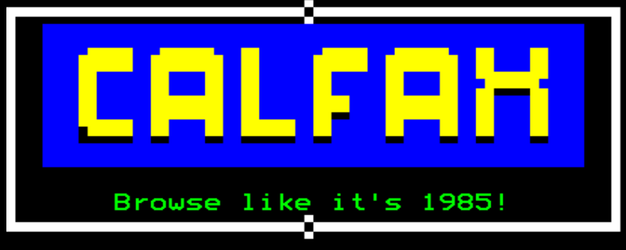
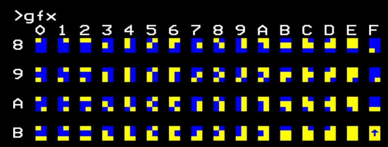
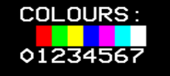

# CALFAX
This is the source for my website, written as an homage to teletext and retro computing in general.



## How it Works
The terminal uses a character set taken from the Mullard SAA5050 character generator chip, used in countless TVs and the like. The text characters come from [here](https://github.com/billtubbs/text-bitmaps/tree/master/bitmaps/SAA5050), and the graphics characters were generated by myself using the Python script [generate_saa_graphics.py](src/lib/util/generate_saa_graphics.py).

The terminal is a configurable character grid based on an HTML canvas element. The grid is updated every frame by the `TerminalRenderWorker` which pushes the pixels to the canvas.

### Character Code
To enable saving and loading to and from the terminal, the state of the screen can be encapsulated by representing each character (including its position) by a 32-bit integer, in the following configuration:

```
# 0XXXXXXX YYYYYYYI DDBBBFFF CCCCCCCC
# X position
# Y position
# I = 1 if inverse
# D ≠ 00 if double height
# B = background colour
# F = foreground colour
# C = character index
```
The advantage of encoding the position into the character code is that 'blank' characters do not need to be included, saving space.

The character index follows ASCII for the first 128 characters. Following this, in the next 64 bits the Mullard SAA5050 graphics character set is used, in which each character is a 6-bit grid:




### Colours
As with the original Teletext spec, the colours are represented as a 3-bit integer, as follows:



### PageEdit
The PageEdit application exploits the character code system to allow for saving and loading. For each character that isn't blank, it is concatenated into an 32-bit array and then that array is converted to base64 string encoding. From this, the string can be saved and loaded from the terminal.

### Calfax "OS"
A simple terminal interface capable of running "programs" is also provided in the OS.ts file. Effectively, each program is class with an asynchronous `run` method, which is called by the OS. All key events are passed to the OS, which then passes them to the currently running program, which also has control of the terminal.

## Installation
### Clone the repository
`git clone git@github.com:C-Lunn/CALFAX.git`
### Install the dependencies
`npm install` or whichever package manager you use -- I recommend `bun`.

## Run it
`npm run starthttps` will start a development environment. You will need to run in an HTTPS context for the terminal to work, and so dummy certificates are also provided in this repository.